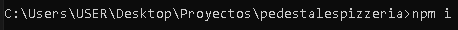

# Proyect name: 
pedestalespizzeria
# Technologies used: 
Para el proyecto
-IONIC
-vue
-typescript

Para el control de versiones: 
-github
-gitflow

# Branchs
-Main : Rama principal o de producción, es la rama la cual es visible para el publico en general. Es la rama comercial la cual se presenta como el producto final. 
-Develop: Es la rama secundaria del proyecto pero principal para el desarrollo o pruebas. Esta es la rama previa donde se realizan pruebas y soluciona problemas antes de hacer una fusion con la rama Main. 

# Gitflow branches
-feature -> Esta se desprende de la rama de desarrollo (develop) y permite hacer modificaciones sin preocuparce de dañar la rama develop para los demas
-hotfix -> Esta se desprende de la rama de produccion (main) y solo debe ser usada cuando hay problemas urgentes que se deben resolver al instante. 
-

# Commands
-Para crear un proyecto con IONIC se hace mediante el comando "ionic start", se ingresa el nombre del nuevo proyecto y se escoge vue. Si ubiece el caso de que solicita la eleccion de mas opciones, entre las mas comunes se debe seleccionar "css", "typescript", "vite", "EsLint - yes". 

-Despues en la ruta del proyecto se inserta el comando "npm install o npm i", esto lo que hace es instalar todos los paquetes necesarios que esten asignados en package.json. Es muy importante ejecutar este comando cuando se clona o crea un proyecto por primera vez. 

-Los comandos mas comunes de git son :
    *git fetch: Baja todos los cambios del repositorio remoto pero aun no los combina con el repositorio local, es decir lo tiene en espera de confirmacion. 
    *git pull origin nombre_rama: carga y actualiza el repositorio local con los cambios bajados de git fech. 
    *git add . : carga todos los archivos y los prepara para guardar. 
    *git commit -m "comentario" : genera el commit con un comentario (en este paso ya se guardo de manera local los cambios preparados en git add .)
    *git push -u origin nombre_rama: para cargar y fusionar los cambios de la rama local con la rama remota.

